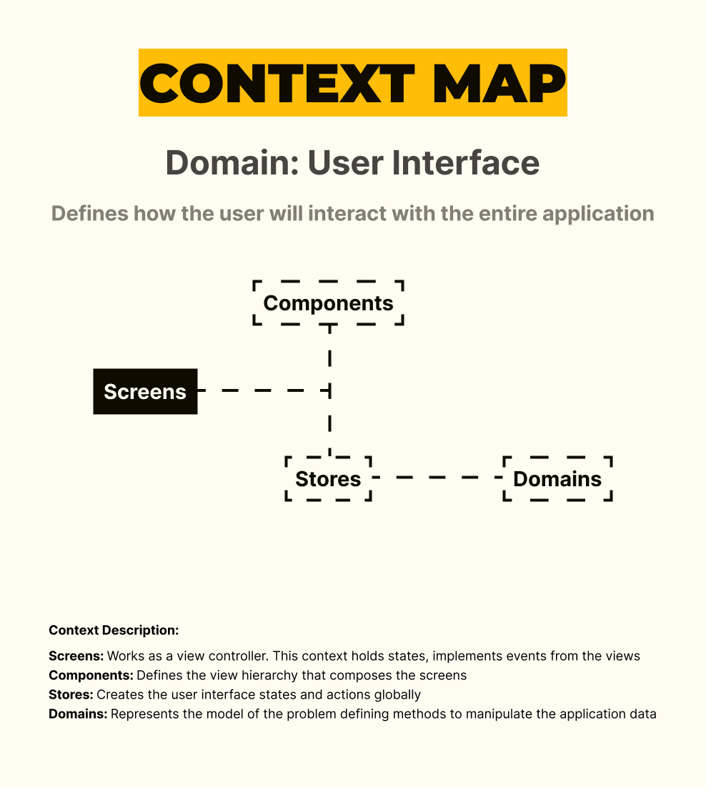

<h1 align="center">
Calculator App With Vue Js, Nuxt Js 3, Bun Js, Docker Compose, Pinia, Typescript, Cypress, Eslint, Prettier
</h1>

 

 

  <a href="#description">✍️ Description</a> &nbsp;&nbsp;&nbsp;|&nbsp;&nbsp;&nbsp <a href="#description">⬅️ Context Map</a> &nbsp;&nbsp;&nbsp;|&nbsp;&nbsp;&nbsp <a href="#install">🔍 Install</a> &nbsp;&nbsp;&nbsp;|&nbsp;&nbsp;&nbsp <a href="#technologies">🚀 Technologies</a> &nbsp;&nbsp;&nbsp;|&nbsp;&nbsp;&nbsp <a href="#related">♟️ Related</a> &nbsp;&nbsp;&nbsp;|&nbsp;&nbsp;&nbsp <a href="#contact">✉️ Contact</a>

 
 

<h3 id="description">✍️ Description:</h3>

Once you have knowledge on design patterns and user interface library (as React Js), it is not difficult to port a whole application to another library like Vue Js. Nuxt Js embraces the Vue in such a way that turns out been really easy to programme, even when your main intent is create your first application with this user interface tool set. The flux architecture is a nice because it does look like MVVM, a structure that can grow with any project, and the Pinia Js delivers you a fancy way to deal with state. All that surrounded by Hexagonal Architecture, programming the project becomes a pleasureful experience.

 

<h3 id="context_map">⬅️ Context Map:</h3>

 

<h3 id="install">🔍  Install:</h3>

To start the service, run the following commands:

**To run the service:**

`./service_starting.sh`

 

<h3 id="technologies">🚀 Technologies:</h3>

To build this project is used:

- Vue Js 3
- Nuxt Js 3
- Bun Js
- Pinia Js
- Eslint
- Prettier
- EditorConfig
- Cypress
- Vite Js
- Docker
- Docker Compose
- Typescript

 

<h3 id="related">♟️ Related:</h3>

See more:

<ul>
  <li><a href="https://github.com/samueldecarvalhodeveloper/Calculator-App-With-Jetpack-Compose-Kotlin-Material-3-JUnit-Mockk-Dagger-2-Coroutines-Ui-Automator">Calculator App With Jetpack Compose</a></li>
  <li><a href="https://github.com/samueldecarvalhodeveloper/Calculator-App-With-React-Native-Expo-Custom-Hooks-Typescript-Async-Storage-Prettier-Eslint">Calculator App With React Native</a></li>
  <li><a href="https://github.com/samueldecarvalhodeveloper/Pokedex-API-With-Elixir-PHP-Python-Laravel-Phoenix-FastAPI-Uvicorn-Asyncio-Unittest-PHP-Unit-Docker">Pokedex Api With Laravel</a></li>
</ul>

 

<h3 id="contact">✉️  Contact:</h3>

**Email:**
<a href="mailto:personal.samuelcarvalho@gmail.com">personal.samuelcarvalho@gmail.com</a>

 
 

<strong>Repository Link:</strong>

[https://github.com/samueldecarvalhodeveloper/Calculator-App-With-Vue-Js-Nuxt-Js-3-Bun-Js-Docker-Compose-Pinia-Typescript-Cypress-Eslint-Prettier](https://github.com/samueldecarvalhodeveloper/Calculator-App-With-Vue-Js-Nuxt-Js-3-Bun-Js-Docker-Compose-Pinia-Typescript-Cypress-Eslint-Prettier)
